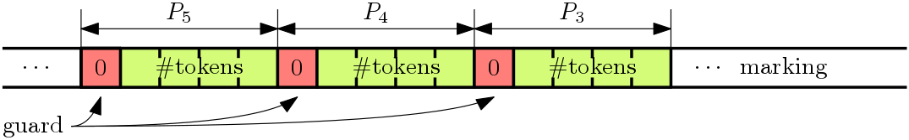
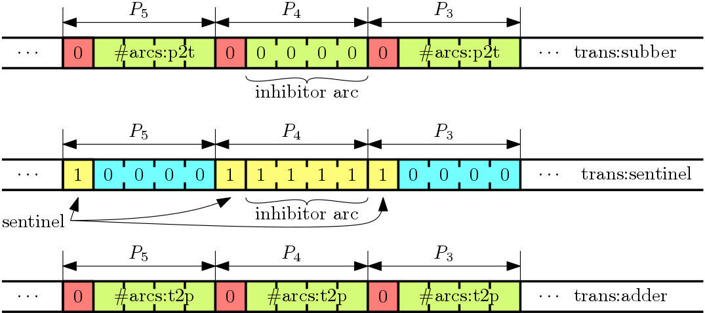
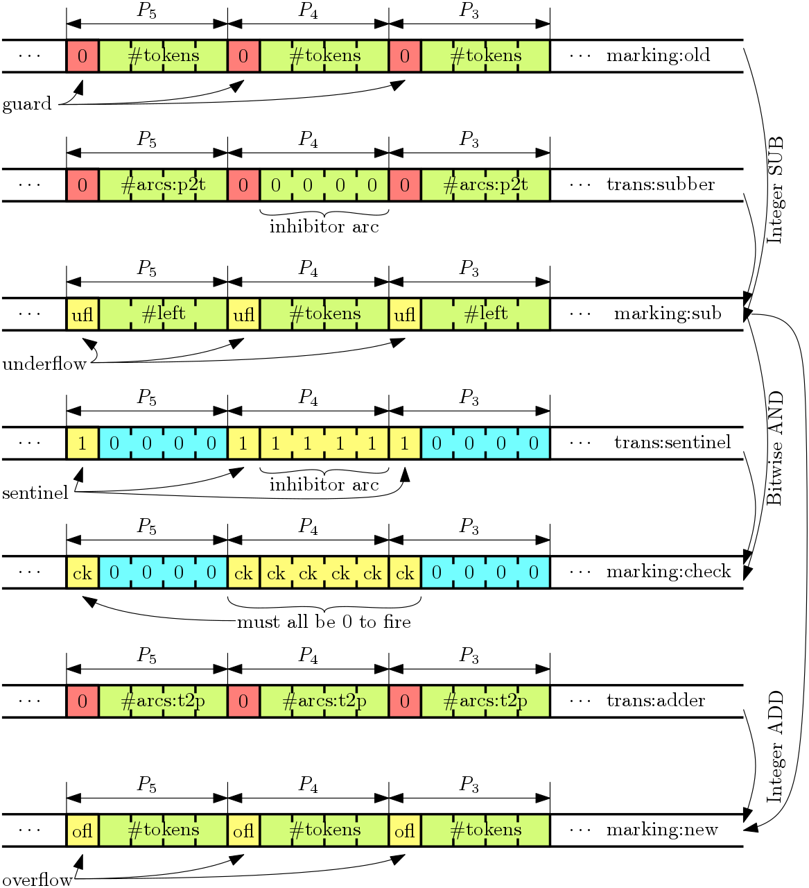

# Bitfield Vectors to Implement Petri Nets

> *Bitfield Vectors store all state of a Petri Net in one integer
> (of arbitrary size), and need only simple calculations
> to determine in O(1) time whether a transition may fire.*

Petri Nets are potent as expressive instruments, but it is the
efficient implementation used here that really makes it attractive
in everyday use.  Our technique was pioneered for Erlang, but can
be ported to other languages that have arbitrary-sized (or very
large) integer support in either the language itself, or in a
library.

## Markings are Bitfield Vectors

We coined the term *Bitfield Vector* for the practice of encoding a
vector of small integers, often just a few bits each, in an
integer.  We do this to encode the number of tokens that are
present in a place at any point in time, the so-called *Marking*
of a Petri-Net.

We currently use the same number of bits for all places; the
images shown below suggest 4 bits for a range of 0 to 15 tokens.
On top of each of these bitfields, we add a *guard bit* valued
zero; though this is slightly wasteful of space, we put this
space to good use in the upcoming calculations.

This image shows a long integer with a few of the places
encoded as a bitfield wiith its protective zero guard.
The least significant bit is drawn on the right side, and
it should be clear that this pattern can be repeated for any
number of places, as long as the integer holding this value
scales up to the size needed.

The smallest number of bits per place is determined at compile-time;
it must be able to hold the values used below, and since any
practical implementation consists of a number of native
memory words, there is an option of exploiting more bits
than the minimum.  For instance, in Erlang the integers
are implemented on 60 bits or on a multiple of 64 from
3*64 upward, and the compiler chooses the smallest of
those that can match, and once that has been established,
it will space out the places over as many bits as possible.

During run-time, it may be found
that more bits are needed, in which case all the values
kept as bitfield vectors will shift up in such a way that
the reasoning followed here brings the same results, just
with more bits than in an individual place.

Petri Nets don't have to start without tokens; in general,
they are said to have an *initial Marking*, which is the
number of tokens initially assigned to each place.  Evidently,
an initial marking fits the bitfield vector format as well as
any intermediate marking.

## Sentinels are On Guard

The guard bits will help us detect underflow when a transition
wants to consume tokens from a place, and the same bits help
to detect overflow when a transition produces tokens and adds
them to a place.

The *Sentinel* is a Bitfield Vector that has a 1 in the bit
positions of the guard bits, and a 0 elsewhere.  We use it
with bitwise AND, followed by a test that the outcome is
zero.  We also refer to this as the *General Sentinel*, to
clarify the distinction with another type coming up below.

Note that a sentinel can be layered over any marking to
always yield a zero outcome.  This is because the guard bits
are always 0 in an acceptable marking.

## Transition Map

The *Transition Map* or *transmap* for short is a
dictionary structure, keyed with the identity
of a transition, and whose values form a triple of
values describing the transition:

  * The *Subber* is a Bitfield Vector that subtracts
    tokens from places; this encodes the place-to-transition
    arcs and their multiplicity;
  * The *Addend* is a Bitfield Vector that adds tokens to
    a places; this encodes the transition-to-place arcs
    and their multiplicity;
  * The *Transition Sentinel* or *trans:sentinel* is a
    Bitfield Vector that indicates bits that should be
    zero after subtraction; this is a more elaborate
    from of the General Sentinel, additionally marking
    inhibitor arcs (as descibed further down).

The reason why we talk of vector operations is that
the operations needed can usually be applied to
large integers as a single, highly optimised operation
with an assembly-coded inner loop:

  * Integer SUBtraction
  * Integer ADDition
  * Bitwise AND
  * Comparison with 0

One can also imagine these simple operations on
implementations of SIMD technology in modern CPUs,
such as Intel's MMX or ARM's NEON.  That would be
only slightly different from what is described
here, and/but it would be more platform-specific.

## Consuming Tokens through Subtraction

Arcs from places to transitions, or *p2t* arcs for
short, subtract tokens can only be part of a firing
transition when enough tokens are present in a place.

The Subber for a given transition holds a bitfield for
each place, so it is possible to store the multiplicity
for each place-to-token path; multiplicities may arise
from multiple arcs drawn separately and/or from an
annotated multiplicity on those arcs.  When no arcs
exist, the multiplicity is zero, which is neutral to
subtraction.

Every place in the Subber is topped off with a guarding
bit valued 0, like in the Markings.  This means that the
mere value of the multiplicities in the Subber will not
lead to changes in that bit position.

To prepare for testing if a transition can fire, given the
current Marking, we subtract the Subber from the Marking,
to find an intermediate value that we shall nickname
*marking:sub* in this discussion.

## Testing for Firing

After subtraction, the test if firing may commence is
to overlay the *marking:sub* value with a Sentinel.  This
concentrates on the underflow bits, or the former guard bits
that flip to 1 if more has been subtracted from a place
than it holds in tokens.  If any of the guarded bits
is non-zero, the transition should be abolished and the
*marking:sub* value should be forgotten.

Note that underflow leads to borrowing from the
higher-up bitfield if it exists, or to a negative
result if this higher-up bitfield does not exist.
Since the underflow bit already indicates the need
to abolish the outcome, these extra changes are of
no influence.

## Mixing in Inhibitor Arcs

An *inhibitor arc* forbids a transition to take place
when tokens are present in a certain place.  It is drawn
as an arc with a circle attached to the transition,
instead of the usual arrow head.

Since Perpetuum does
[not yet](https://github.com/vanrein/perpetuum/projects/2?)
add meaning to multiplicity for inhibitor arcs, there is
no use in having both an inhibitor arc and a normal arc
between the same place and transition, so this is not
supported.

Inhibitors indicate places that should have their bitfield in
the Marking set to zero.  This can be checked with a few
extra bits, compared to the General Sentinel.  The value
subtracted is zero, which reflects that no normal arc is
present between the place and transition, and the
*trans:sentinel* sets the bits representing this place to 1
so the bits must all be zero-valued.  This could already be
seen in the drawing of the Transition Map before.

In comparison to the situation before adding inhibitors,
we now use the more elaborate Transition Sentinel and
not the General Sentinel; it is more elabore by having
more bits set than just the guard bits, but otherwise
the transition handling remains the same.  To make the procedure
completely standard, a *trans:sentinel* will be defined
for every transition; however when no inhibitor arcs lead
to the transition, its *trans:sentinel* will have the same
value as the General Sentinel.

## Producing Tokens through Addition

Once it has been settled that a transition can fire, its
*marking:sub* can be used as a basis for production of any
output tokens.

Tokens are produced along transition-to-place arcs, or
*t2p* arcs for short.  As before, there is in general a
multiplicity to apply, caused by multiple inidividual
arcs and/or an annotated multiplicity on each arc.
Without any arc to a place, its multiplicity in the
transition is zero.

And as before, the multiplicity is for the current transition
and an individual place, each of which are separately
represented in a bitfield vector.  The Addend consists of
a Bitfield Vector holding the produced number of tokens in the
respective positions, with a guarding 0 bit added on top.
Once added to *marking:sub* without underflow, it produces
a value that we shall nickname *marking:new* in what follows.

The output of this operation is the principal new marking
that occurs after the transition completes.   Whether it
does, may also depend on application logic that could
land an error or defer its firing until a timeout has
passed.

## The Complete Calculation

The complete calculation is shown in the following
diagram:

## Reflowing after Overflow

When *marking:new* is to be valid as a marking, we have
one concern to address, and that is the value 0 in each of
the guard bits.  This can be checked by overlaying the
prospective new marking with the sentinel.  The resulting
bits reveal an overflow as a result of the addition.

Overflow is not an error condition, but it merely tells
us that the number of bits for the respective places is
insufficient.  When we encounter this situation, we need
to reflow the value; otherwise, we can skip this step.

Reflow is less efficient than the bulk operation of
transition testing and application; it should be needed
only rarely, so this is acceptable.  Its need results from
an open-ended number of tokens in each place in a Petri Net;
though static analysis may shed some light on maximum
numbers of tokens for places, this is not always possible
for Petri Nets that occur in practical applications; hence
the need to reflow, making good use of the arbitrary sizes
of integers in the underlying platform.

When a platform does not support large-enough integers,
this would be a reason to raise an error.  It is worth
noting however, that whatever leads a transition to fire
is deliberately unspecified for Petri Nets, so as long as
other transitions can fire, a constrained implementation
may alternatively choose to defy the attempted transition
and hope to reduce the tokens in the troubled places
through other transitions.  If nothing more can fire
however, we have run into a deadlock caused by a lack of
resources, and a formal error must be the conclusion.

Reflowing is done automatically by the library code of
Perpetuum, in platforms implemented on this principle of
bitfield vectors.  It reflows the places of the new marking
as well as the sentinal and the triples of the transition
map.  Not all values are reflown in the same manner; a
sentinel is approached with a different method than a
marking, subber or addend.

## Atomic Transitions

Formally, a transition in a Petri Net fires in zero time.
This is a bit of a clumsy aspect in the concept, especially
when implemented on computer systems which require time to
do their thing.  The practical replacement of the concept
therefore is to say that transitions fire atomically.

Atomicity means a few things:

  * Either a transition fires completely, or not at all.
    There is no room for half work.

  * No intermediate state of a transition can be detected.

This is easily implemented when only one process at a time
is working on a transition; but then there would have to be
a claim on tokens in a place, which in turn... it ends up
being complicated.  The only solution would be to have only
one process active at a time for any given Petri Net.

This does not mean that Petri Nets scale badly; most often,
there will be multiple instances of the same network, and
each of the instances can have their own active process.

In Erlang, there is a rather pronounced way of doing these
things; a separate process guards the Petri Net instance.
This is possible due to the light-weightedness of those
processes.  In C, no such single manner of doing things
exists, so the support ends by being supportive of general
event loops, in the hope that these will be used to
distribute the work wisely.

## Dedicated Implementations (including Embedded Code)

The principles described here work well with off-the-shelf
integer operations.  This does not mean that no further
optimisation would be possible.  Especially in embedded
environments, where large-integer libraries are not a
given, there is room for improvement.  Dedication towards
support of Petri Nets may also lead to extensions of the
primitives of general-platform code along the same lines,
though.

Just like the computation *X^Y mod M* can be implemented
more efficiently in one operation than in two, and its
use in cryptography has led to widespread acceptance, we
can see the transition test being implemented more
directly as a three-way operation.

The bitwise AND followed by non-zero testing is an
obviour case for quick gains; this procedure can quit
as soon as a bit set to 1 is found; there is no need
to store the intermediate result but instead a direct
pipeline from the AND to the outcome can be had, and
a short-circuit logic can cut short the traversal of
a long integer.

Somewhat similarly, it would be possible to also
incorporate the subtraction.  Now the operation
becomes the three-parameter computation
*(A - B) & M == 0*.  Again, intermediate values
need not be stored, which can mean a great deal
to garbage collection behaviour, especially on
small-memory machines such as an Erlang process.
Specifically, when actively testing what transitions
can proceed form a certain marking, this would be
a great gain.

In the computations presented here, we first
subtract, then add.  This is not possible anymore
when the intermediate value is not stored.  This
is not a problem however, when the computation
shifts from *(A - B) + C* to *A + (C - B)*.  The
computation of *C - B* can be done ahead of time,
by a modified compiler geared towards this style
of code.

## Efficient overview over Transitions that CanFire

The discussion so far has been concerned with the
question whether an arriving event can fire.  This
is a different question from asking for the set of
transitions that can fire at a certain moment.

It is likely that the technique presented here can
be generalised to search for transitions that can
fire, by first matching ranges of Subber values for
a first place, and within that ranges for the next,
and so on.  A tree-based search structure may be
derived that makes this check more efficient than
mere looping over all transitions and end up with
*O(n)* time complexity.

## Sharing the Structures after Reflow

Although reflow helps to update transition maps
to a larger scale, it would have to be repeated for
each individual Petri Net.  It is easy for the
compiler to generate a number of generations of
transition maps and sentinels, and the results
can be shared.  Moreover, at least in Erlang, these
literal values and structures are shared among
processes and so they place no burden on the
memory footprint; the storage capacity needed
for a Petri Net is really just one integer, which
is especially pleaseant because of the language's
memory model which concentrates allocation and
garbage collection within each process, but with
relaxation for any literals referenced.  When
larger integers are needed than ever expected,
the reflow process and literal sharing would be
the least of worries, so at some point the system
falls back to dynamic reflow.

There are a few ways in which this schema may
still be improved.  Static analysis of Petri Nets,
or perhaps manual annotations, could convey an
upper limit to the number of tokens in some of
the places.  This means that the number of bits
for those places can be set to a fixed number.

Likewise, if there would be a minimal number of
tokens in a place, it could be subtracted from
various values; but that would already be true
at the design stage, which indicates that this
is a silly path of improvement for the compiler.

The guard bits and corresponding sentinel bit
protection does seem to be required in all cases.
If this was not the case, a p2t arc would not
help to structure synchronisation in the
Petri Net, which means it adds no value and could
probably be dropped altogether.  So again, this
is not a proper path of improvement for the
compiler or its generated output.

