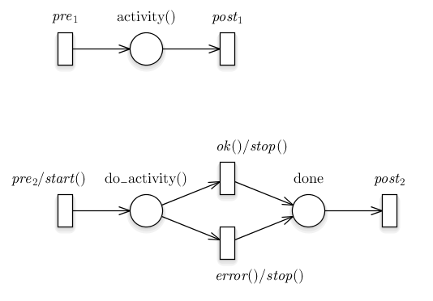
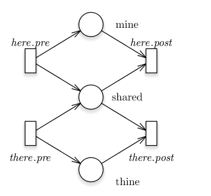
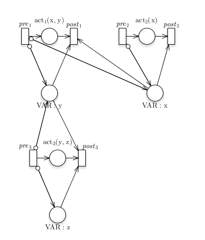

Driving Workers from Petri nets
===============================

>   *When we define a Petri-net, we describe synchronisation. When we describe
>   events, actions and activities, we describe work to be synchronised. What
>   remains to be done is to link the two.*

First, a few words about the semantics / meaning of Petri nets. Then, we'll move
into more practical territory, and deal with the attachment of actions,
activities and events to our Petri nets. We will end with a few remarks about
variable locking, which can also be automated by the Petri net logic and
incorporated into correctness proofs.

In Petri-net theory, transitions fire in zero time. In practical uses, this
usually translates into an atomic or indivisable operation. To achieve this
property, we should only annotate quick, transactional operations on a
transition:

-   *quick* because the rest of the Petri-net will be put on hold while the
    transition takes place; without this measure the mangement of the
    synchronising properties would get much more complex, probably a lot slower
    and certainly more difficult to get right;

-   *transactional* because, upon failure, the transition should not take place
    and any results should be rolled back; note that this can be so pragmatic as
    to limit a rollback such that it is not observable from the Petri net
    perspective.

Anything that takes time and must not hold up the rest of the Petri net should
be attached to places, where tokens sit and wait. There are no limiting
constraints on this in Petri nets; even better, the firing of subsequent
transitions is modelled as non-deterministic behaviour, which means that model
correctness makes no assumption on this, and so any implementation works. Note
specifically that there is no need for randomness in the implementation of
transition firing, at least not from a Petri-net correctness viewpoint; other
reasons such as fairness may still apply of course.

Transitions may link to Events and (Trans)Actions
-------------------------------------------------

The syntax of a transition annotation is

~~~~~~~~~~~~~~~~~~~~~~~~~~~~~~~~~~~~~~~~~~~~~~~~~~~~~~~~~~~~~~~~~~~~~~~~~~~~~~~~
TransitionAnnotation ::= [Event] ["/" Action]

Event ::= Identifier [ "#" Number ] "(" Args ")"

Action ::= Identifier [ "#" Number ] "(" Args ")"

Args ::= Arg  ( 0*( "," Arg ) )

Arg ::= Identifier | "&" Identifier
~~~~~~~~~~~~~~~~~~~~~~~~~~~~~~~~~~~~~~~~~~~~~~~~~~~~~~~~~~~~~~~~~~~~~~~~~~~~~~~~

### Events

Transitions *may* respond to the occurrence of an event. Events are externally
sourced notifications. It serves as the mechanism to supply asynchronous updates
to the Petri net. Typically, an asynchronous program has a so-called event loop
that delivers events to worker threads; in this case, the delivery is not to a
thread but to the Petri net's event handler routine, which may trigger a
transition which in turn may trigger activity in the same thread or another.

The advised mode for the generated code is to run as a single thread; and indeed
it is the only possible code mode until further notice. If work is sent off to
the background through threads and processes, then the management of all this
work and processing of events reporting their outcome can work quite
efficiently. It is the bulk work, the activities in our case, that needs to be
sent off to a worker -- a separate thread or process.

**Timing.** When an event arrives for which no matching transition is available,
then the event is ignored. It is not difficult to always have a transition ready
to fire when an event is expected, not with the 0-time concept of a Petri net
transition; and it is not difficult to create transitions that always accept a
given event (thought that leads to an unbounded number of tokens in the
subsequent place).

**Match-all.** When multiple transitions can fire in response to an event, then
they all fire, though not in a known order. Note how the order may in fact stop
others from firing, and the question whether firing will occur does of course
depend on the number of tokens in place at the time of firing.

**Arguments.** Event annotations can use the value-binding argument
`&Identifier` as well as the value argument `Identifier`. The value argument
serves to select whether an event is welcomed; the value-binding argument picks
up a variable value from the event and adds it to its "colour" or structure
definition.

### (Trans)Actions

Recall that actions have a *Fast \`n' Final Firing* paradigm, quite unlike
activities that may linger for a while. You may remember this by thinking of
(Trans)Action; namely, that an action is also a transaction -- it either
succeeds completely, or fails.

Use this for sending off simple messages to other parts of your infrastructure,
but not for time-consuming activities such as running a commandline program and
fishing something out of its output.

An action returns one of `Success`, `Failure` or `Defer-by-N-seconds`. Only when
it returns `Success` may there be lasting impact on what the Petri net can see
-- meaning, at least, the contents of any variables. So, when passed as a
binding variable, the impact on the variable must be anihilated unless `Success`
is returned.

The reason for demanding no impact is that the Petri net will sometimes
*attempt* to make a transition when it has sufficient tokens, but the code may
decide that it is not possible for some reason.

The deferral option exists to support waiting for a certain time, perhaps in an
exponential fallback scheme, or just to wait for a DNS TTL time so all caches
are up to date with a newly added record. In support of deferral, the action is
always called with extra information from which a prior deferral time can be
derived.

There is no explicit mechanism to change the flow of a Petri net based on the
failure outcome of an action. We may at some point allow a `!` prefix to an
action name, to interpret `Failure` as `Success`, and we may at that time infer
links between transitions that form alternatives without actually trying an
action again, but for now that is not part of the model. We may also decide to
write this failure-processing mechanism as an internally generated event to be
handled like all the other events. Again, this is not yet done.

Places may link to Activities
-----------------------------

Actions that take some time to complete, such as a commandline operation or
perhaps the generation of a new private key, are not usually done in na Action,
because they would end up holding up the execution of the Petri net, eventually
at the expense of its achievable level of concurrency. We use the other part of
the Petri net, namely the Place, to host such tie-consuming things.

The syntax for the annotation of a Place with an Activity is

~~~~~~~~~~~~~~~~~~~~~~~~~~~~~~~~~~~~~~~~~~~~~~~~~~~~~~~~~~~~~~~~~~~~~~~~~~~~~~~~
PlaceAnnotation ::= Identifier "(" Args ")"
~~~~~~~~~~~~~~~~~~~~~~~~~~~~~~~~~~~~~~~~~~~~~~~~~~~~~~~~~~~~~~~~~~~~~~~~~~~~~~~~

Places may link to Activities
-----------------------------

When a token enters a place, the related Activity is started in the manner
specified in its implementation. There may be one or more alternative ways of
running an Activity, but the Petri net is impartial to such choices; they are
concealed from the process building and left up to the generated code that
invokes the activity.

While an activity runs, its token will not leave the place. This is not part of
normal Petri net semantics, but it can be, as a result of the non-determinism in
firing rules for transitions. And indeed, in our generated code, this will be
the case.

When an activity ends, its associated token *may* leave the place, or it may be
kept there for a bit longer. It is vital to understand that tokens cannot be
forced to go through transitions if the process model does not agree. So the
place may force a token to stay inside it, but other places can do similar
things, so a place cannot force a token out.

The termination of an activity may return a result code that selects which
outgoing arcs could be followed. In general, the outcome of an activity is
enumerated, and may trigger a matching arc. The arc is therefore annotated with
a (list of) result value(s) from the preceding place's activity. When an arc
mentions a result value, it will be preferred over the others; multiple arcs may
mention the same result value. Arcs without result value annotation function as
catch-alls and are only used for non-mentioned result values.

### Activities with Multiple Outputs

There may be situations where activities yield multiple output tokens. For
instance, it might send out a token for each line in a file being processed. Or
a token for each LDAP entry found as result of a query.

In general, places in Petri nets cannot spontaneously generate tokens. The
analysis tools for Petri nets would not function correctly if we changed this
fact. But we might build a somewhat different Petri net that can do this.

We use the mechanism of the result value, except that those are now considered
intermediate results. What is clasically thought of as an exit code is in this
case a delivery of a result value followed by an independently commanded suicide
(or equivalently, the detection that suicide has taken place).

We model this approach as follows:

 

What is important in this diagram is that the non-exit result codes point back
to the central place for the activity. This place is not the activity itself,
because its start and end are externalised to the preceding and following
transitions.

This diagram also shows clearly an extra place that holds the token after the
activity is done. This is an explicit representation of the activity semantics
described before.

A model builder needs to be aware of a few things when using this powerful
facility. First, there may be problems with the boundedness of the diagrams
drawn like this. Second, there may be problems passing around data because
colours may end up sharing information. Thirdly, loose tokens may have to be
consumed in the end, perhaps in conjunction with a lock on the progress of other
network branches.

Superposition of Places and of Transitions
------------------------------------------

Superposition is the (automatic) combination of Petri nets to form one larger
Petri net. This can be quite helpful in simplifying our view on the whole
structure. The process of "adding" Petri nets is called superposition.

TODO: Find formal specifications, we are probably right but should check that.
TODO: GreatSPN uses special tags for this, AFAIK; how general is that?

### Superposition of Places

Two places with the same TODO:name are considered to represent the same place.
This is true when they occur in one Petri net diagram, but also when they occur
in different ones. The only condition is that they are processed together as one
bundle of Petri nets.

One application of this mechanism is a shared place "Failed" that is handed
tokens for those work flows that failed. Another practical use is to communicate
between Petri nets drawn separately; one diagram may place a token in a "start"
place, and sit back and wait until it pops back up in a "done" place; another
net than handles the requested action.

Care should be taken to avoid unintended "spilling" of tokens between Petri
nets. This can usually be achieved by holding a token next to the shared net,
provided this is consistently done.

### Superposition of Transitions

Two transitions with the same TODO:name are considered to represent the same
transition. This is true when they occur in one Petri net diagram, but also when
they occur in different ones. The only condition is that they are processed
together as one bundle of Petri nets.

One application of this mechanism is tacking on to a transition in a standard
library with an added condition (through an additional incoming arc) or an added
trigger (through an additional outgoing arc).

That in turn, can be used to have "static subscription" type interactions. A
scheduler that is willing to trigger multiple parallel threads of action may
declare those threads by adding tokens to places, or they may simply have a
transition that triggers to start anything that attaches to it through
superposition.

Automating Locks on Shared Variables
------------------------------------

Actions use variables, TODO

Activities are meant to run concurrently, but may still want to access
variables. This leads to a possible problem in terms of access to those storage
locations, and overwriting each other's values.

To protect variables used in an activity, we need to add locks over them. This
could be done in the implementation code, but that would mean that part of the
concurrency model is taken out of the scope that can be analysed. So instead, we
advise to generate additioning locking structures in the Petri net. We provide
the tools to do this.

Such locking structures use a place for each variable, and these are combined
through superposition, which makes it easy to define them locally. The matching
tag (the TODO:name) will be set to `"VAR:" Identifier`. We advise incorporating
such generated Petri nets in the formal validation rounds, so as to avoid that
no new deadlock conditions are introduced over variables.

Such locks are not always necessary; for instance, a value argument `Identifier`
will sample a current value, and that has no implications for locking. On the
other hand, a binding argument `"&" Identifier` requires a lock for it to work,
since writes are exclusive and may occur at any time. In light of readers that
don't lock, it is paramount that the writes are only done when the lock is held.
When read under a write lock, the values are stable, which is useful for
stability towards future writes. TODO: Variables are not set together? Make
colour-writes atomic?

## Low-level Library API

At the lowest possible level, there is code.  And linking and driving this code
from the Petri nets.  The manner in which this is done depends on the function
in the Petri net:

  * **Actions** are named `atom_xxx`, where `xxx` is replaced by the `Identifier`
    in the `Identifier "(" Args ")"` syntax.  There are a few standard parameters
    and then each of the `Args` follow, as a pointer for `"&" Identifier` form and
    as a call-by-value for the `Identifier` form.  The return value is of type
    `trans_retcode_t`, which represents the `Success`, `Failure` and
    `Delay-by-N-seconds` returns.  **TODO:** Perhaps point to a thread instead?
    **TODO:** Should variables' read/write variants be declared in the library?

  * **Events** are typed in the same way as Actions, but they are called in the
    opposite direction.  To that end, the Petri net scheduler will register
    through `cbreg_xxx`, where `xxx` is constructed as for Actions.  An event
    does not return anything, so its return type is `void`.

  * **Activities** are named `do_xxx` with the same replacement for `xxx` as for
    Actions.  They are called with standard parameters including a callback
    function for delivering results, and whether the activity has ended.
    **TODO** Might use `start_xxx` and `stop_xxx` instead for more control; but do we want that?
    **TODO** Why not register the callbacks statically, like events?

