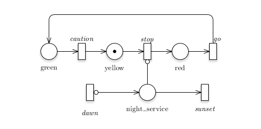

# QuickStart Demonstration


> *Lots of talk over here, but how do you try it out?*

## Prerequisites

Fetch our version of `pntools` and install it,

    git clone https://github.com/vanrein/pntools
    cd pntools
    python setup.py install
    cd ..

Download the
[GreatSPN Editor](http://www.di.unito.it/~amparore/mc4cslta/editor.html)
for your graphical platform and install it as you are used to.

And, of course, download the latest &amp; greatest version of Perpetuum,

    git clone https://github.com/vanrein/perpetuum
    cd perpetuum/compiler/demo

We will be working from that directory below.

## Play with the Traffic Light model

Start the GreatSPN Editor and load the file `traffic_light_nightly.PNPRO`.
The file format is native to the editor, and although we may one day end up
supporting it directly, we currently rely on the standardised exchange format
[PNML](http://pnml.org)
-- even though we are acutely aware of its shortcomings.

The picture you should now be seeing is a traffic light with night service:



The top cycle represents a traffic light, with a token (the black dot) cycling
through `yellow`, `red` and `green` when the intermediate transitions `stop`,
`go` and `caution` fire.  When you imagine these to be triggered by timer
events, you can already see the process taking shape.

There is an additional facility, represented by the place `night_service`,
in which only the yellow light is active.  This is triggered at `dawn` and
it ends at `sunset`.  As long as a token is in the place `night_service`,
a token in place `yellow` cannot proceed.  But from other places it can move
freely to `yellow`.  This is arranged with so-called *inhibitor arcs*, shown
with a small circle.

You can play with this in GreatSPN.  Just press the green start button and see
the transitions that may fire light up.  Click them.  Play with it.  See what
happens.  When done, click the red close button and land in editing mode once
more.

In a later pass, you can play with rewiring this diagram.  For now, let's
follow a standard flow.

Save your file if you need to.  It will get a `.PNPRO` extension.

Export your file in the "standard" format PNML, using the file name
`traffic_light_nightly.pnml` used below, and saving in the directory where
you found the `.PNPRO` file.

Now continue on the command line.

    ../perpetuum-codegen.py traffic_light_nightly.pnml

You will see some more-or-less helpful output, mostly for our own debugging
purposes.  You now have a couple of generated files (that we also included
in Git for now, for the simplicity of those who want to look around):

  * [traffic_light_nightly.out](compiler/demo/traffic_light_nightly.out)
    is the PNML file once more, of little current
    use.  We will get to that later, when we combine multiple Petri nets into
    one;
  * [traffic_light_nightly.pidx](compiler/demo/traffic_light_nightly.pidx)
    pairs with
    [traffic_light_nightly.pkey](compiler/demo/traffic_light_nightly.pkey)
    to reveal how
    [cmph](http://cmph.sourceforge.net)
    maps places to integers in a minimal perfect hash;
  * [traffic_light_nightly.tidx](compiler/demo/traffic_light_nightly.tidx)
    pairs with
    [traffic_light_nightly.tkey](compiler/demo/traffic_light_nightly.tkey)
    to reveal how `cmph -v -m xxxidx xxxkey` maps transitions to integers
    in a minimal perfect hash;
  * [petritypes.h](compiler/demo/petritypes.h)
    is generated by our code; it defines the smallest standard
    integer types that can capture place and transition references;
  * [traffic_light_nightly.h](compiler/demo/traffic_light_nightly.h)
    and
    [traffic_light_nightly.c](compiler/demo/traffic_light_nightly.c)
    are the generated files based on the Petri nets.

There are a few other files you may be concerned with:

  * [lightmain2.c](compiler/demo/lightmain2.c)
    is a simple `main()` program for this traffic light demo;
  * [model.h](include/perpetuum/model.h)
    defines the general structures (and heavily uses the basic types derived in
    [petritypes.h](compiler/demo/petritypes.h);
  * [runtime.c](src/runtime.c)
    handles firing and placement of tokens;
  * [flatsched.c](src/flatsched.c)
    contains the flat scheduler;
  * [Makefile](compiler/demo/Makefile)
    collects the C sources generated and fixed into a demo program.

So we build and test

    make
    ./traffic_light_nightly | head -n 10

This should output a small sequence of automatically fired transitions,

```
Prior to scheduler with red=0, green=0, yellow=1
Entering scheduler with red=0, green=0, yellow=1
Firing dawn -- now=1486732226, notbefore=0, firstfail=0
Firing sunset -- now=1486732226, notbefore=0, firstfail=0
Firing dawn -- now=1486732226, notbefore=0, firstfail=0
Firing sunset -- now=1486732226, notbefore=0, firstfail=0
Firing dawn -- now=1486732226, notbefore=0, firstfail=0
Firing sunset -- now=1486732226, notbefore=0, firstfail=0
```

*Sigh.*  Yes, this is correct.  As one of the possible implementations of the
Petri net's non-determinism, you can indeed always fire the same transitions
first.  Besides correct, this is also boring and non-representative.

Recent changes to the demo have made this more interesting by incorporating
event handling; we get to press `d` to initiate the `dawn` transition and
`s` for `sunset`; when done, we can press `q` to quit the simulation.
The interaction is rudimentary, and calls for pressing Enter after such keys.

If you feel you would like more control then you would be perfectly
reasonable.  This is a demo of just our Petri net compiler; we want to
allow for it to be embedded in an environment that triggers some of the
events.  This is all work to be done, indeed.

Another thing yet to come is validation, though you might find the
[tools](TOOLS.MD) to do it yourself; as this is basically external to
the Perpetuum toolkit.  More on that [elsewhere](USING.MD) -- in terms
of this example, what could you validate specifically?  You probably
don't want `red` and `green` to hold a token at the same time.  But
how about `red` and `night_service`?  And if you cloned this diagram,
what additional requirements would there be for the `red1` and `green2`
states of the various lights, given that they represent overlapping
pieces of concrete?  To get such requirements to validate, would it
help to model colours, or (also) those pieces of concrete that are
claimed by them?  This is the line of thinking we are moving towards.

*Have fun playing!*
