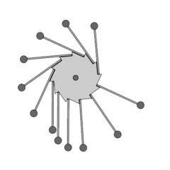

# Perpetuum: Event loop Code Generation from Petri-nets

> *Perpatuum is a code generator for event loops that uses Petri-nets as
> their input.  In a Petri-net, transitions fire in zero time or, more
> practically, in an atomic action.  This is used to intitiate and detect
> events.  Petri-nets help to reroute processes in a verifiable manner.*

This work was initiated for the Key Manager component of the
[IdentityHub](http://internetwide.org/tag/idhub.html)
in the
[InternetWide Architecture](http://internetwide.org/tag/architecture.html).
This Key Manager is confronted with controlling LDAP, PKCS #11, Kerberos,
DNS/DANE/DNSSEC, and internal facilities for authorisation.  In general, it
is safe to say that

  * The relation between the tasks should be tightly managed;
  * These relations are fairly complicated;
  * These relations may vary over time and across deployments.

To avoid ending up with a monolithic Key Manager that is only good for one
purpose, we dediced to create Perpetuum as a coordinator of the individual,
simple tasks.  The coordination is based on descriptions in Petri-nets,
which means that:

  * Graphical tools exist to overview and modify the system process design;
  * Tools exist to prove various correctness requirements of a new design;
  * Graphical tools exist for simulation and animation of the new design.

Given that the remainder of the problem consists of relatively simple
actions, such as "send a message over LDAP", this takes away quite a lot
of the burden when adapting the Key Manager to new situations, be they
driven by technical advances or operations in different contexts.

## Programming Model

The Petri net engine is principally invoked with events to process.  Its
current design is not re-entrant; instead, it is considered part of the
work-distributing part of an event loop.  Actions that are started from
the Petri net are therefore assumed to be snappy actions that can quickly
return.

Snappy actions are not so surprising for an event-driven system.  There
should be no waiting for other threads or processes, but instead an
action is started in the background, and once ready its results will be
picked up by another event.  So, instead of creating a new private key
we will issue a command to have one.  And indeed, the work will be sent
off over Remote PKCS #11, for which we devised an asynchronous ASN.1 model,
meaning a separate data representation for a remote procedure call and its
completion.

Transitions fire up such snappy actions, but do not necessarily assume
that they will succeed.  In fact, the adagio is to try a transition and
see if it worked.  The return value can be one of `TRANS_SUCCESS`,
`TRANS_FAILURE`, `TRANS_MAXDELAY`
or `TRANS_DELAY(numsec)` where the latter means to delay
the work for `numsec` seconds, perhaps because a resource is locked or
because a timer should expire before we may continue.  Only when the
returned value is `TRANS_SUCCESS` is it possible to have a lasting
result or ongoing activity.  The other return values indicate that the
attempt to fire up the action has failed, and any half-done work has
been rolled back.  [TODO: INTRODUCE IDEMPOTENCE]

While developing snappy chunks, you need not worry about the Petri net
in which your code is running.  You should of course be aware that some
pairing between starting and ending a background task is useful, but even
the connection between your code and the Petri net are done by the same
person who designs the Petri net.

## Petri net Design

To design a Petri net, you need not be concerned with the implementation
of the actions that are started from your net, or how events enter the
Petri net.  All you need to do is make the connection to the action or
event by their name.  Do read how these may be related; it will often be
the case that an action starts a background process and reports back on
its success or failure through an event.

Petri nets are a bit like the assembly language of the process algebras.
They have little structure, thereby allowing you all the room you need
to design a smart process flow -- and to screw up while at it.  There
are however a lot of tools that can validate your process flow for you.
You can not only enter your Petri nets graphically, but you will also
find that you can simulate them running, and see tokens move from place
to place while doing so.  This should be enough to sharpen your intuition
about the design process you are in.  And as if that isn't enough, there
are tools that formally prove all sorts of properties of Petri nets to
assure you that it will not run into problems when you deploy them.

### Formal Testing Opportunities

TODO: List tests that could be useful -- xlate math lingo into deployment speak.

### NOTES after discussion with Adriaan de Groot

  * Time-consuming processes can justly be run in a place
  * The non-determinism of Petri-nets helps to challenge/cripple formal tools (meaning, avoid that they jump to illegit conclusions) but implementations invariably add choices that may be more concrete (without breaking any formal properties)
  * One way of being concrete in an implementation is: a place can fire when its action is done (but the transition needs to be ready for it too, so waiting may be involved)
  * It is possible to refine one place into a sequence with intermittent transitions, *except* when the last transition responds to not having a token (through an inhibitor arc) -- in which case these inhibitors must attach to all the intermittent places too
  * This helps to avoid a very common pattern of "trans/init, place/ready, trans/request, place/wait, trans/response, place/done" and instead we can often just write "trans/init, place/ready2response, trans/response" (or so...)
  * Processes run in places need not always exit in the same way; they may also side-step on error or other considerd-useful distinct situations
  * Events reamin valuable on transitions; incoming places define preconditions for them being noticed (?) or for them passing through; we should be able to express both where one can be a simple pattern around the other
  * It is probably also nice to allow lightning-fast actions initiated on transitions; this is indeed suggested by the literature too, where places represent states (of rest); indeed, processes in places can be seen as an abbreviated form of request/wait/response (which is how Petri nets can be used to model activities in UML Activity Diagrams)

With longer-running processes, colour can be endangered; writes may replace values in multiple places at the same time; this might be overcome in a number of ways

  - Use locks, either in the activities or in the surrounding generated code
  - Analyse such that colour aspects (parts of user type space) never overlaps (using k-bound analysis and a few extra places and arcs between conflicting parts?)
  - Use analysis of such extra colour aspects to add the extra places and arcs in the Petri net that enforce 1-boundedness of the collection of places that access the same piece of information
