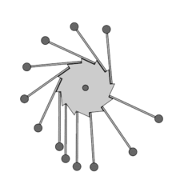

# Using Perpetuum in your Application



> *Perpetuum is a code generator and data model for Petri nets used to
> describe the event loops of asynchronous systems.  Here is how to use
> this software.*

The following explains how you can use Perpetuum in your Applications.

## Identify Actions and Activities

The first thing you will want to do, is list the actions that you need to
have in your problem domain.  Actions are quick, snappy functions that
return a state of success after initiating a possibly larger process,
such as a forked process that creates an RSA key, or the configuration
of your web browser, or sending off an LDAP query.

As a general design rule, **Actions should never block/wait on anything.**

Actions will be bound to Petri-net transitions, where they implement
**Fast `n' Final Firing**, meaning, they take no (virtual) time, or in
computational terms, they run atomically, or in database terms, they are
isolated operations.  In Perpetuum, they are indeed run like that.

Larger compositions must necessarily run concurrently, which can be
properly synchronised with Petri net formalisms.  We call such
compositions of actions or transitions plus intermediate waiting times
as Activiites.  **Activities are sub-processes that take time to complete.**
These are not implemented through blocking, but by counting on an event
that signals completion or another form of progress.  As part of the
activity support framework, Perpetuum will help you connect its
constituent actions together through such things as request identifiers,
or process IDs.  In addition, data can be carried between the actions
and even the events.


## Design your Initial Processes

Even though there is no strict requirement for you to do it immediately,
you probably want to try if your identified set of actions and activities
match your problem domain, and if they suffice for designing the process
structures that you have in mind.  So go ahead, and design your process.

We deliberately call this your initial process, because **Processes can
still be modified during Deployment.**  This is the great strengt of
Perpetuum; it does not hard-code the process logic but instead generate
it from a Petri net.  Change the design, regenerate your code and you
are ready for another brand of action.

Perhaps it is not entirely correct to say that processes are still open
for change during deployment; in fact, **New processes involve rebuilding
the Perpetuum application** but there are no concerns about their
impact on the set of actions and activities that were coded in support
for (a class of) processes.

To facilitate this style of working, we do advise you to have
configuration parameters for the process diagrams to use.  This can
be manipulated easily through the CMaked configuration mechanism,
even through a GUI if so desired!


## Validate your Process Models

The generation of code from Petri nets constitutes little more than a
mapping to arrays that define the structure of the networks, just enough
for the schedulers to run.  The runtime does not check if there are
deadlocks or livelocks, or any other concurrency problems.

**You validate your Process Models before you run them.**

Petri nets have one great advantage, and that is a plethora of analysis
tools.  They let you be sure that there are no intrinsic problems in
your models, even before you run them.  This helps us to ignore such
aspects at run time, and thus be smaller, faster, and cuter.

**Use graphical tools where you can.**  Sure, it is simpler to enter
textual data, but it is not as pleasant for people who design new
diagrams during deployment.  Graphical tools exist for many process
modelling tasks with Petri nets:

  * View and Edit process models
  * Simulation of process models
  * Validation of process models
  * Animation  of process models

Pretty neat for a mathematically accurate model, uh?  The things to
watch for are that you have the right kind of Petri nets, because
there are as many as the mathematicians working on them; but we are
quite mainstream in processing only:

  * Simple P/T Petri nets
  * Arcs may define multiplicity in numeric inscriptions
  * Inhibitor arcs


## Implement your Activities

Activities are useful for you while designing your processes, but they
barely have meaning to Perpetuum.  The only parts of interest are:

  * What data is stored between actions
  * What data is used to recognise events

You will end up specifying a data structure, or several, and attaching
those to the Petri net token.  They form the "colour" of your token.

Please note that tokens are recnogised by their colour; those parts
used to find back tokens must be unique.  TODO: Or could we trigger
multiple, based on pattern?  Do we want that?  Well, not initially `;-)`

Any scoping of the data you rely on is up to you.  Things need not
be kept solely inside an activity, and activities need not even be
hierarchically structured!  The turning side of the coin is that
you cannot count on data privacy.  There is no data security either;
the various colours are assumed to collaborate (by not overwriting
data outside their allocated room).

Your token data will be initialised to all-zero bytes.  More wordy:
**All tokens are created equal; they are all black.**  On top of
the initialisation, there is support for initialisation and cleanup
actions.


## Implement your Actions

Your code should always
```
#include <perpetuum/model.h>
```

Your actions have the following function signature:
```
trans_retcode_t (*my_action) (
			PARMDEF_COMMA (pnc),
			transref_t transition,
			time_t *nowp,
			void *opt_evdata);
```
Note the mention of `opt_data`; this is a data structure that can
pass in data from an event.

These functions should do a snappy bit of work, without blocking or waiting,
and return one of the values
```
#define TRANS_SUCCESS 0
#define TRANS_FAILURE (~(trans_retcode_t)0)
#define TRANS_DELAY(t) ((trans_retcode)(t))
#define TRANS_MAXDELAY ((TRANS_FAILURE)-1)
```

Note how there could be misinterpretations for `TRANS_DELAY(0)` as well as
`TRANS_DELAY(~0)` and since some delays may be derived from external data
sources (such as a TTL delay), there is a safer variation,
```
#define TRANS_DELAY_SECURE(t) \
		(((t)==TRANS_SUCCESS)? \
			1: \
			(((t)>=TRANS_FAILURE)? \
				(TRANS_FAILURE-1): \
				(t)))
```
You have been warned!

If you need to lookup transitions or places by name, then you could;
efficient lookup functions are generated as minimal perfect hash functions
TODO:AT_SOME_POINT, but you are of course still advised to look for them
while being setup (rather than for individual calls).  Functions to help
you with that are
```
placeref_t find_place (const petrinet_colour_t *pnc, const char *name);
transref_t find_trans (const petrinet_colour_t *pnc, const char *name);
```
Be vigilent however -- why do you need this information?  Normally, your
concern should be local, and not care for other places and transitions.
Any communication should be done over the token colours / instance data.


## Implement your Events

Events are the subject of
[semantic navel staring](https://github.com/vanrein/perpetuum/issues/1)
`;-)` though we are taking a practical angle initially.

Usually, a transition that wants to respond to an event will return
`TRANS_MAXDELAY` when it is triggered by the scheduler.  It can detect
such situations by looking at the `opt_evdata` parameter, which is always
`NULL` when invoked from the scheduler, and usually non-`NULL` when called
from an event handler.

A typical transition action following this line would look like
```
trans_retcode_t my_action (PARMDEF_COMMA(pnc)
						transref_t tr,
						time_t *nowp,
						void *opt_evdata) {
	if (opt_evdata == NULL) {
		/* Called from the scheduler, refuse to make the transition */
		return TRANS_MAXDELAY;
	} else {
		/* Called from event, process data and try to return success */
		... = ((my_data_t *) opt->evdata)->...;
		return TRANS_SUCCESS;
	}
}
```

The event callback should be directed to one particular Petri net instance.
the reference in `pnc` indicates which.

When the event is the result of a response to a request that was sent before
in an action on a transition, then it may be prudent to also have a timeout
transition starting from the same place as the transition holding this action.
This way, the wait for a response can be kept limited and any token that
indicates work should be going on can always be consumed after due delay.


## Connect Actions and Events with your Process Model

Perpetuum is used by two kinds of developers; one is the initial developer
of an application, the other is a deploying party.  The former controls
actions and events, as well as an initial process model; the latter
controls only process models.  In both cases, there is a need to connect
events and actions to the transitions in the process model.

There is an automatic default, which is to use the name of a transition
up to an optional slash as an identity.  Slash and beyond are considered
remarks or informal distinctions between different places where an event
or action is used.  They are different transitions in the models, but
trigger the same action or event (and tools sometimes force different
names, which we override with the slash subnaming scheme).

So, by using proper names in your process model you will automatically
connect to actions and events in the backend.

TODO: Do we want to override this binding in any way?


## Build your Application

Application building is normally done only by application developers, but
Perpetuum may also ask for it during deployment, when new process models
are used.  This means that a gentle mechanism is required.  For make that
workable, we are relying on CMake and its graphical configuration interface.

TODO: Configure (in CMake), then build, test, package, run


